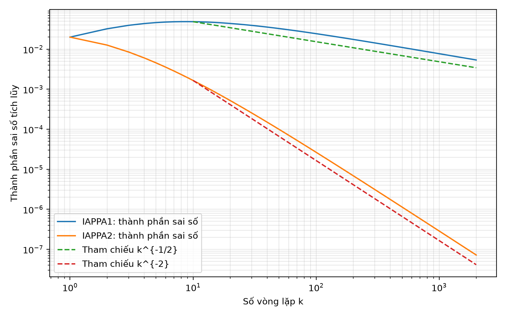
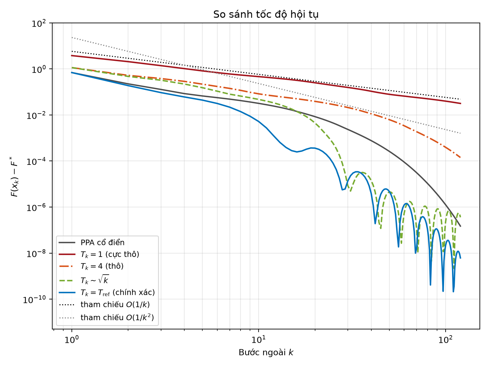
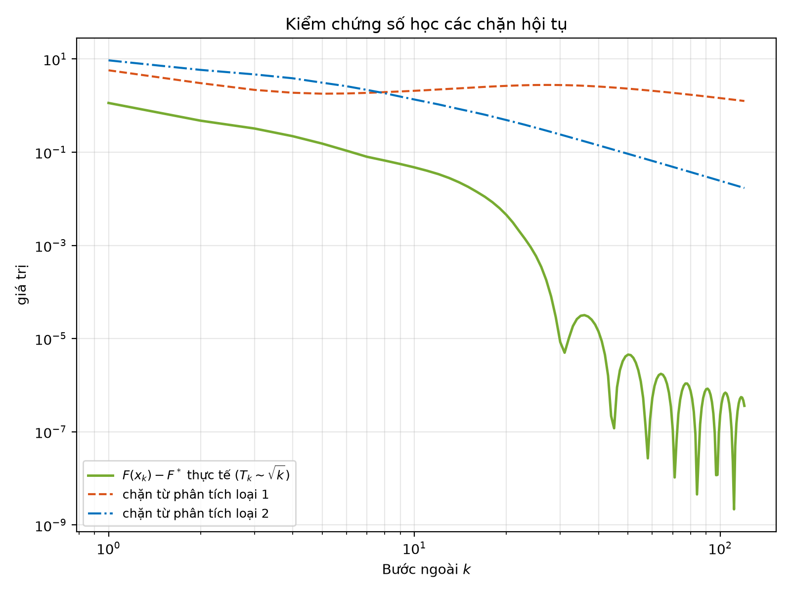

# Thuật toán điểm gần kề tăng tốc có sai số

**Inexact and Accelerated Proximal Point Algorithms** — báo cáo, slide, kịch bản thuyết trình và thực nghiệm số tái lập được, trình bày lại công trình của **Saverio Salzo & Silvia Villa** (*Journal of Convex Analysis* 19, 2012).

[](https://github.com/tu-h-nguyn/inexact-and-accelerated-proximal-point-algorithms/actions/workflows/build.yml)


[](LICENSE)

> **In English.** This repository reproduces and extends the analysis of Salzo & Villa (2012) on
> inexact accelerated proximal point algorithms. The paper identifies a subtle flaw in Güler's 1992
> convergence proof for the inexact case and rebuilds the analysis on a flexible *estimate sequence*
> framework. The deliverables are a 34-page report, a 45-slide deck, a presentation script, a
> condensed standalone essay, and two fully reproducible numerical experiments (Python + MATLAB)
> that verify both theoretical bounds numerically. All documents and figures are rebuilt in CI.

---

## Câu hỏi trung tâm

Toán tử gần kề

$$\operatorname{prox}_{\lambda F}(y) = \arg\min_x \Big\{ F(x) + \tfrac{1}{2\lambda}\lVert x-y\rVert^2 \Big\}$$

hiếm khi có công thức đóng: trong thực tế mỗi bước lặp phải **giải một bài toán con bằng một thuật toán khác**, tức là chỉ thu được một xấp xỉ. Năm 1992 Güler kết hợp PPA với ngoại suy Nesterov và công bố tốc độ $\mathcal{O}(1/k^2)$ — kể cả khi tính xấp xỉ.

Salzo & Villa chỉ ra rằng chứng minh đó có một lỗ hổng tinh tế: lập luận **ngầm sử dụng dưới gradient tại điểm gần kề chính xác** — một đại lượng không thể tính được khi ta chỉ có xấp xỉ. Bài báo xây dựng lại toàn bộ phân tích trên khung *dãy ước lượng* và trả lời: **tốc độ hội tụ còn giữ được hay không phụ thuộc vào việc bộ giải bài toán con cấp cho ta loại chứng nhận sai số nào.**

| Loại sai số | Điều kiện | Tốc độ thu được | Ý nghĩa thực tế |
|---|---|---|---|
| **Loại 1** (AT1) | $0 \in \partial_{\varepsilon^2/2\lambda}\Phi_\lambda(z)$ | $\mathcal{O}(1/k)$, kể cả khi $\sum_k\varepsilon_k = \infty$ | Tiêu chí dừng tự nhiên nhất, nhưng **mất hết lợi thế tăng tốc** |
| **Loại 2** (AT2) | $\frac{y-z}{\lambda} \in \partial_{\varepsilon^2/2\lambda}F(z)$ | $\mathcal{O}(1/k^2)$ nếu $\varepsilon_k = \mathcal{O}(1/k^q)$, $q>1/2$ | Khắt khe hơn, nhưng **khôi phục đầy đủ tốc độ bậc hai** |
| **Loại 3** (AT3) | $d(0,\partial\Phi_\lambda(z)) \le \varepsilon/\lambda$ | — | Tương đương prox chính xác của một đầu vào bị nhiễu |

Kết luận đắt giá nhất: **tăng tốc không miễn phí.** Nếu chỉ đo được sai số theo loại 1, thuật toán tăng tốc chạy không nhanh hơn PPA thường; muốn giữ $\mathcal{O}(1/k^2)$ thì bộ giải bài toán con phải cấp được chứng nhận loại 2.

---

## Kết quả thực nghiệm

### 1. Kiểm chứng bậc hội tụ trên hàm bậc bốn (Python, $\mathcal{H}=\mathbb{R}$)

$F(x)=x^4/4$, sai số dựng **đúng trên biên** ngân sách $\varepsilon_k = 0{,}2/(k+1)^{7/4}$ để không vô tình tạo nhiễu có lợi. Hồi quy $\log\delta_k$ theo $\log k$ trên đoạn $500 \le k \le 2000$:

| Phương pháp | $F(x_N)-F_\star$ | Hệ số góc của $\delta_k$ | Bậc lý thuyết | Sai lệch chứng chỉ $\lvert\rho_k-1\rvert$ |
|---|---|---|---|---|
| Tham chiếu (giải gần chính xác) | $5{,}266\times10^{-13}$ | — | — | — |
| **IAPPA1**, $q=7/4$ | $6{,}067\times10^{-10}$ | $-0{,}521$ | $-1/2$ | $8{,}0\times10^{-12}$ |
| **IAPPA2**, $q=7/4$ | $7{,}440\times10^{-16}$ | $-1{,}989$ | $-2$ | $7{,}8\times10^{-10}$ |

Hai hệ số góc đo được khớp với hai bậc lý thuyết đến chữ số thứ hai — chênh lệch giữa loại 1 và loại 2 hiện ra rõ ràng bằng số.

<p align="center">
  
</p>

### 2. Bài toán elastic-net / LASSO không có prox đóng (MATLAB + Python)

$F(x)=\tfrac12\lVert Ax-b\rVert^2 + \tfrac{\rho}{2}\lVert x\rVert^2 + \mu\lVert x\rVert_1$ với $n=80$, $m=30$, độ thưa $s=8$. Ở đây $\operatorname{prox}_{\lambda F}$ **thật sự không có công thức đóng**, nên bài toán con được giải bằng FISTA nội — số vòng lặp nội $T_k$ chính là "nút vặn" sinh sai số có kiểm soát.

Điểm đáng chú ý về mặt cài đặt: **chỉ cần một lần giải gần đúng** là thu được đồng thời cả hai chứng nhận, vì $F$ lồi mạnh hệ số $\rho$ cho phép chuyển thẳng

$$\varepsilon^{(1)} = \sqrt{2\lambda\,\delta_{\text{inner}}}, \qquad \varepsilon^{(2)} = \varepsilon^{(1)}\sqrt{\tfrac{\lambda\rho+1}{\lambda\rho}}.$$

Nhờ vậy cùng một quỹ đạo $(x_k)$ đi qua được cả hai bộ sổ sách kế toán sai số và hai chặn lý thuyết được so sánh trên **cùng một dữ liệu**.

<p align="center">
  
  
</p>

Kết quả: lịch trình $T_k \sim \sqrt{k}$ giữ được tốc độ $\mathcal{O}(1/k^2)$ gần như ngang với việc giải chính xác, trong khi $T_k$ cố định ở mức thấp tụt về $\mathcal{O}(1/k)$. Cả hai chặn lý thuyết đều được kiểm chứng: **0/121 bước vi phạm** ở cả loại 1 lẫn loại 2.

---

## Cấu trúc repository

```
├── main.tex              Báo cáo đầy đủ (34 trang) — điều phối chương/mục, \input từ content/
├── slide.tex             Slide Beamer (45 trang) — dùng lại đúng các file trong content/
├── transcript.tex        Kịch bản thuyết trình dạng screenplay (20 trang)
├── metadata.tex          Tên đề tài, nhóm, thành viên, GVHD, ngày — sửa DUY NHẤT ở đây
├── refs.bib              Thư mục tài liệu tham khảo (BibTeX)
├── content/              Thân bài dùng chung cho cả ba tài liệu trên
│
├── essay/                Tiểu luận rút gọn, độc lập (12 trang, 8 mục, bib riêng)
├── docs/                 Ghi chú đọc bài báo + bản thảo thô của kịch bản
│
├── code/
│   ├── matlab/           Thực nghiệm LASSO gốc (sinh 3 hình vector cho báo cáo)
│   └── python/           quartic_iappa.py + lasso_iappa.py (bản port, chạy được trong CI)
│
├── figures/              Toàn bộ hình dùng trong tài liệu (.pdf vector + .png)
├── results/              Bảng số liệu .csv do thực nghiệm sinh ra
│
├── Makefile              make all / figures / clean
└── .github/workflows/    CI: build 5 PDF + chạy lại thực nghiệm mỗi lần push
```

---

## Biên dịch

```bash
make all        # main.pdf, slide.pdf, transcript.pdf, essay/essay.pdf
make notes      # docs/ghi-chu-bai-bao.pdf
make report     # chỉ báo cáo
make clean      # xoá file trung gian, giữ PDF
```

Không có `make`? Chạy tay (lặp `pdflatex` để mục lục và `\cite` ổn định):

```bash
pdflatex main.tex && bibtex main && pdflatex main.tex && pdflatex main.tex
```

**Yêu cầu:** TeX Live với `texlive-lang-other` (gói `vietnam`/`vntex` cho tiếng Việt), `texlive-latex-extra`, `texlive-science`, `latexmk`. Trên Overleaf: upload cả repo rồi đặt `main.tex` làm main document.

## Tái lập thực nghiệm số

```bash
pip install -r code/python/requirements.txt
make figures        # ~13 giây, ghi đè figures/*.png và results/*.csv
```

Bản MATLAB (sinh 3 hình vector `.pdf` dùng trong báo cáo) chạy riêng:

```matlab
cd code/matlab
main_experiment      % ghi thẳng vào ../../figures/
```

Hai bản cho ra cùng một kết luận định tính; con số tuyệt đối lệch nhau vì bộ sinh số ngẫu nhiên của NumPy và MATLAB khác nhau. Bản Python là bản chạy trong CI, nên **người đọc không có MATLAB vẫn tái lập được toàn bộ kết quả**.

---

## Quy ước biên soạn

### Một nội dung, ba đầu ra

`main.tex`, `slide.tex`, `transcript.tex` cùng `\input` các file trong `content/`; mỗi bản chỉ hiện phần dành cho mình nhờ package `comment`:

| Environment | Báo cáo | Slide | Kịch bản |
|---|:---:|:---:|:---:|
| `essayonly` | ✅ | ❌ | ❌ |
| `slidesonly` | ❌ | ✅ | ❌ |
| `scriptonly` | ❌ | ❌ | ✅ |

Chứng minh chi tiết và lập luận dài nằm trong `essayonly` (chỉ vào báo cáo); slide chỉ giữ phát biểu định lý và công thức chính. **Muốn biết chính xác nội dung nào đang hiện trên slide** thì đọc phần *không* nằm trong `\begin{essayonly}...\end{essayonly}`.

### Thêm một mục mới

1. Tạo file trong `content/` theo quy ước `chap{chương}_{thứ tự}_{tên gợi nhớ}.tex`, chỉ viết thân bài (**không** viết `\chapter`/`\section` trong đó).
2. Thêm `\section{...}` rồi `\input{content/ten_file.tex}` — làm ở **cả `main.tex` lẫn `slide.tex`**.
3. Cần `\ref{}` từ nơi khác thì gắn `\label{...}` ngay sau `\section`.

### Quy tắc chung

- Overleaf chỉ cho 2 người sửa cùng lúc nên nhóm dùng repo này thay thế — **commit + push thường xuyên**.
- Không commit file build (`.aux`, `.log`, `.bbl`, PDF sinh ra…) — đã có trong `.gitignore`. Hình trong `figures/` là dữ liệu đầu vào nên vẫn được commit.
- Đánh nhãn công thức bằng tên gợi nhớ (`\autotag{eq:ten-nhan}`), **không** dựa vào số thứ tự — bộ đếm equation khác nhau giữa báo cáo và slide.

---

## Trạng thái

| Tài liệu | Số trang | Trạng thái |
|---|---:|---|
| `main.pdf` — Báo cáo | 34 | ✅ Biên dịch sạch, không còn tham chiếu/trích dẫn treo |
| `slide.pdf` — Slide | 45 | ✅ Biên dịch sạch |
| `transcript.pdf` — Kịch bản | 20 | ✅ Biên dịch sạch |
| `essay/essay.pdf` — Tiểu luận | 12 | ✅ Biên dịch sạch, số liệu khớp `results/` |
| `docs/ghi-chu-bai-bao.pdf` | 9 | ✅ Biên dịch sạch |

CI kiểm tra lại toàn bộ điều trên ở mỗi lần push, đồng thời chạy lại hai thực nghiệm số.

---

## Nhóm thực hiện

**Nhóm 10** — Học phần Phương pháp số trong Tối ưu, Khoa Toán – Tin học, Trường Đại học Khoa học Tự nhiên, ĐHQG-HCM.

| Thành viên | MSSV |
|---|---|
| Nguyễn Hoàng Tú | 23110220 |
| Bùi Công Hoàng Vũ | 23110223 |
| Huỳnh Trung Kiên | 22110091 |
| Nguyễn Ngọc Diễm Quỳnh | 21110167 |

Giảng viên hướng dẫn: **TS. Nguyễn Đăng Khoa**

## Tài liệu gốc

> Saverio Salzo, Silvia Villa. *Inexact and Accelerated Proximal Point Algorithms.*
> Journal of Convex Analysis **19** (2012), no. 4, 1167–1192.

Các tài liệu nền tảng khác (Güler 1992, Nesterov 2004, Beck–Teboulle 2009, Rockafellar 1976…) có đầy đủ trong [`refs.bib`](refs.bib).

## Giấy phép

Mã nguồn và phần văn bản do nhóm biên soạn: [MIT](LICENSE). Nội dung toán học được trình bày lại từ bài báo gốc — bản quyền thuộc về các tác giả và nhà xuất bản.
